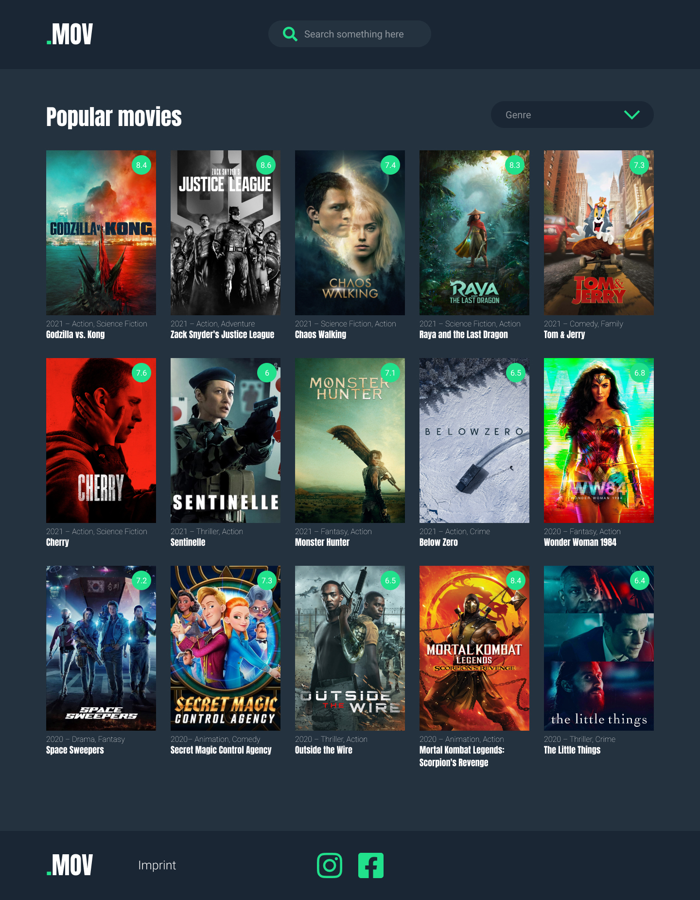
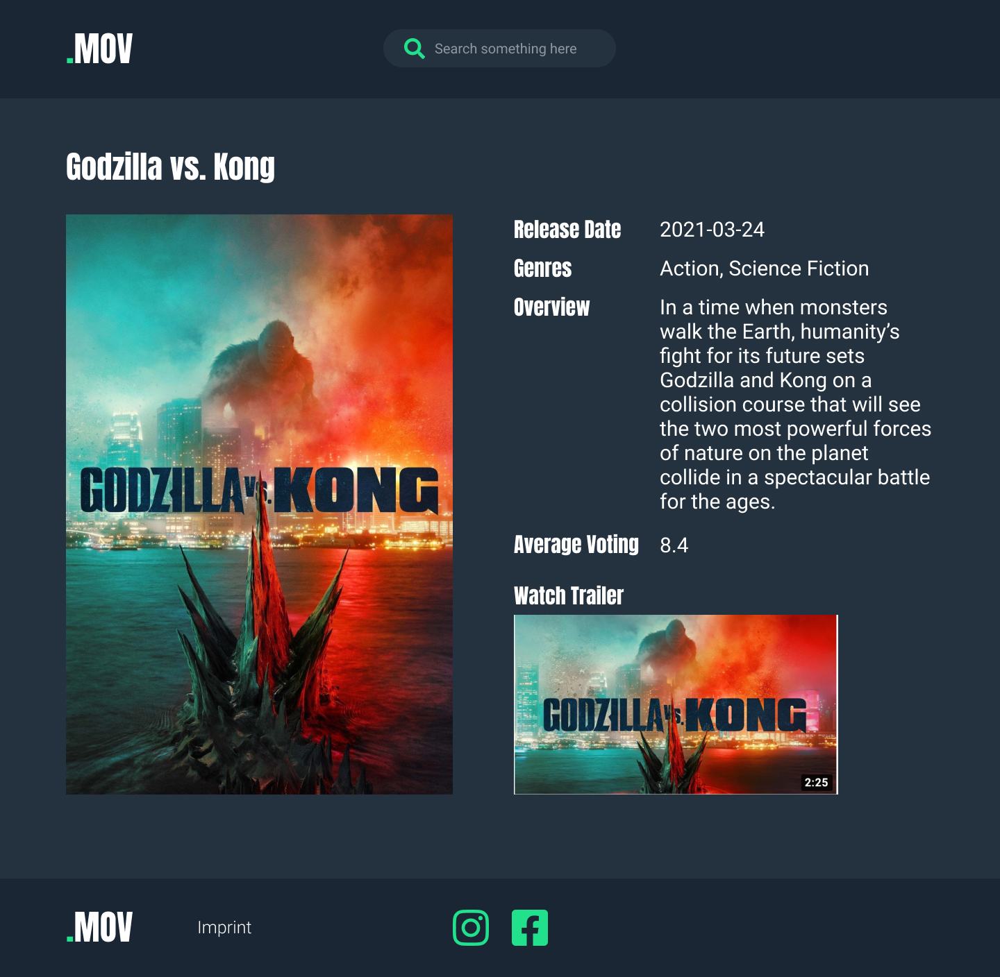

# Mov

Mov is a responsive web application. The user can search for movies and find all the informations that he needs about movies. 

## Technolgy Stack 

The technologies used for the creation of this app are: 
- HTML, JavaScript and CSS
- React.js
- Git
- The Movie Database API.

## Link to the App

here: [SilentMoon](https://p-movie-app.herokuapp.com/) – Go to Silent Moon!

## Screenshots of the app

    
     
     
      

